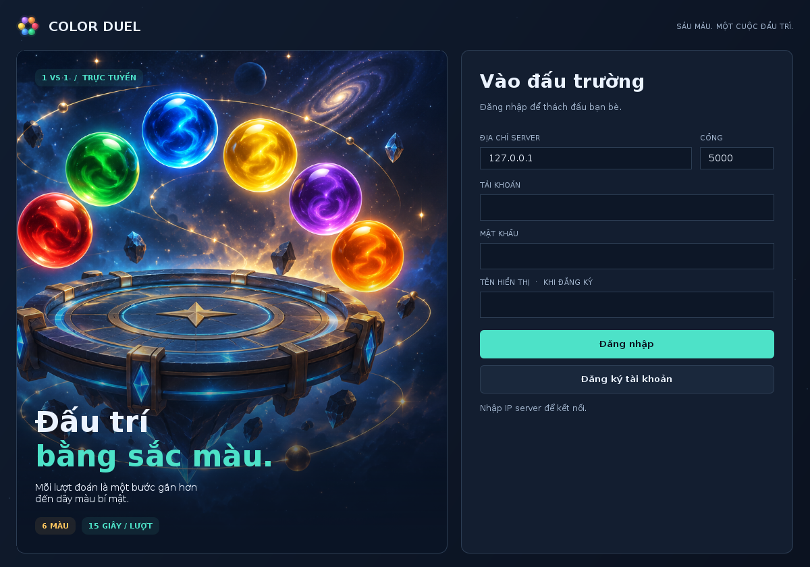
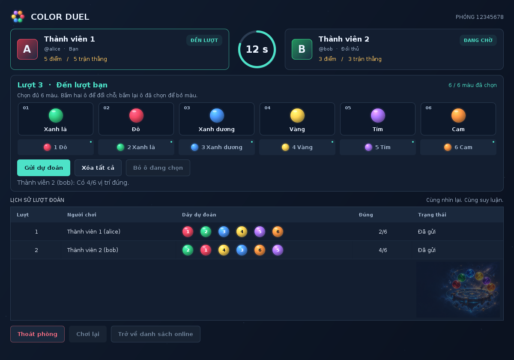
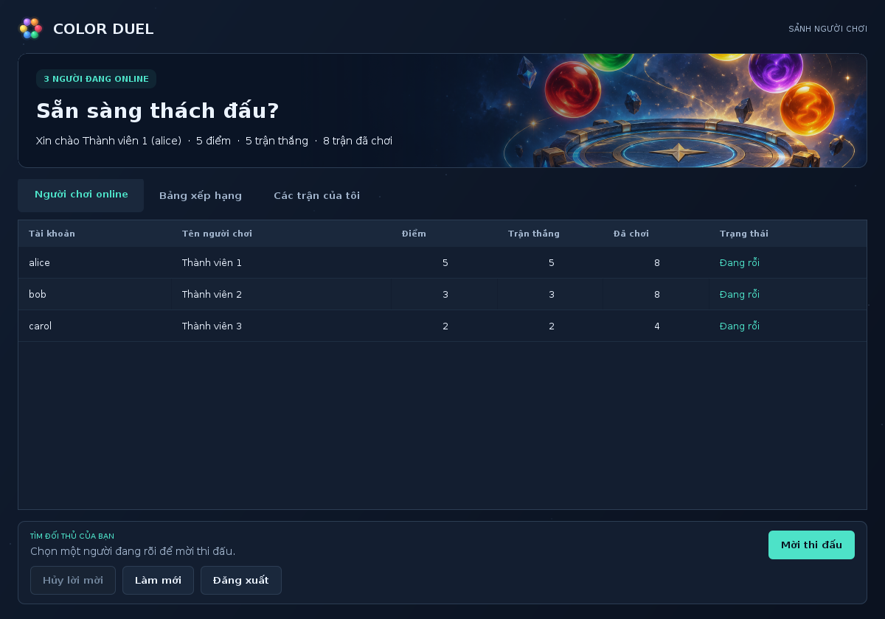

# Hướng dẫn chạy game đoán dãy màu đối kháng online

**Bản giao diện 1.1 ngày 21/09/2026.** Màn hình đăng nhập và sảnh có hình minh họa riêng, phòng chơi có avatar, ô màu hiệu ứng khối và đồng hồ vòng tròn. Hình ảnh được đóng gói sẵn trong chương trình.

**Giữ tài khoản cũ:** dừng server/client, giải nén bản mới vào thư mục riêng, sao chép thư mục `data` của bản cũ sang thư mục `ColorDuel` mới, rồi chạy `demo-1may.bat`. Chi tiết trong `CAP_NHAT_GIAO_DIEN.txt`.



Bộ chương trình này triển khai đề tài trong file **Game_doan_day_mau_doi_khang_online.docx**: hai người chơi **luân phiên**, mỗi lượt **15 giây**, cùng đoán một dãy gồm sáu màu khác nhau. Server giữ dãy bí mật, xử lý luật và lưu dữ liệu; client cung cấp giao diện để đăng nhập, mời đấu, sắp xếp màu và xem kết quả.

Nhóm có thể dùng **một máy server và ba máy client**. Hai client đang chơi một trận, client thứ ba ở sảnh và có thể mời người rỗi. Server là một chương trình Java chạy trên laptop bình thường. Khi phát triển, một laptop cũng có thể mở một server và nhiều cửa sổ client để thử.

Tài liệu đi kèm: [Đặc tả giao thức TCP](docs/GIAO_THUC.html) · [Kết quả kiểm thử](docs/KIEM_THU.html).

## Những gì đã có

| Yêu cầu | Cách chương trình thực hiện |
| --- | --- |
| Tài khoản | Đăng ký, đăng nhập, chặn một tài khoản đăng nhập đồng thời hai nơi |
| Danh sách online | Tên, điểm, số trận thắng, tổng số trận, trạng thái cập nhật từ server |
| Mời đấu | Chọn đối thủ, Mời thi đấu, Chấp nhận hoặc Từ chối |
| Phòng chơi | Đúng hai người; mỗi phòng có dãy bí mật và trạng thái riêng |
| Sáu màu cố định | Đỏ, Xanh lá, Xanh dương, Vàng, Tím, Cam; mỗi màu dùng một lần |
| Thao tác chọn màu | Bấm màu để điền vào ô trống; bấm hai ô để đổi chỗ |
| Lượt và thời gian | Luân phiên, 15 giây/lượt do server quyết định; hết giờ tự chuyển lượt |
| Lịch sử chung | Cả hai thấy người đoán, dãy dự đoán, số vị trí đúng và lượt hết giờ |
| Kết quả | Đúng 6 vị trí thì thắng; thắng +1 điểm, thua +0; cập nhật số trận |
| Thoát và mất mạng | Người rời phòng hoặc mất kết nối trong trận bị tính thua |
| Chơi lại | Hai người cùng đồng ý thì server tạo ván mới, xóa bảng lượt đang hiển thị |
| Dữ liệu | Tài khoản, điểm, trận đấu và từng lượt được lưu trong thư mục data của server |
| Xếp hạng | Điểm giảm dần, trận thắng giảm dần, tổng số trận giảm dần |

Chương trình dùng **Java 17 + TCP Socket + Swing**. Bộ chạy đã biên dịch nằm trong `dist/ColorDuel.jar`. Không cần cài SQL Server, MySQL, Python hoặc thư viện Java ngoài để chạy.



Ảnh trên được dựng từ giao diện Swing trong bộ kiểm thử; các tài khoản và lượt đoán trong ảnh là dữ liệu minh họa.

## Chuẩn bị trên mỗi máy

1. Cài **JDK 17 trở lên**. Nhóm nên thống nhất một phiên bản, ví dụ JDK 17, để dễ hỗ trợ nhau. Có thể lấy bộ cài Windows x64 loại JDK từ [Eclipse Temurin](https://adoptium.net/temurin/releases/?version=17).
2. Khi cài, giữ tùy chọn thêm Java vào **PATH**; có thể bật thêm **JAVA_HOME**. Tham khảo [hướng dẫn cài Windows của Adoptium](https://adoptium.net/installation/windows/).
3. Đóng rồi mở lại CMD hoặc PowerShell. Chạy lệnh dưới đây và kiểm tra phiên bản từ 17 trở lên.
4. Giải nén ZIP bằng **Extract All**. Mở thư mục `ColorDuel` đã giải nén; không chạy file ngay trong cửa sổ ZIP/WinRAR. Có thể đặt tại `C:\ColorDuel` để thao tác dễ hơn.

```text
java -version
```

Chỉ chạy bản JAR cần Java tương thích; cài JDK như trên còn giúp biên dịch và chỉnh sửa mã nguồn. NetBeans là công cụ tùy chọn, không bắt buộc để chạy demo.

## Chạy thử trên một máy

Nên thử bước này trước khi chia sang bốn máy để tách lỗi chương trình khỏi lỗi cấu hình mạng.

1. Nhấp đúp `demo-1may.bat`. Nó mở một cửa sổ server và ba cửa sổ client.
2. Đợi server in thông báo đang nghe cổng `5000`. Giữ cửa sổ server mở.
3. Ở cả ba client, giữ IP `127.0.0.1` và cổng `5000`.
4. Lần đầu, đăng ký ba tài khoản khác nhau, ví dụ `nguoi1`, `nguoi2`, `nguoi3`; tự đặt mật khẩu ít nhất sáu ký tự. Tên hiển thị có thể có dấu. **Không có tài khoản mặc định được tạo sẵn.**
5. Client 1 chọn Client 2 trong danh sách rồi bấm **Mời thi đấu**. Client 2 bấm **Chấp nhận** trong khung lời mời ở cuối sảnh.
6. Hai client vào phòng; một người được server chọn ngẫu nhiên đi trước. Client 3 tiếp tục ở sảnh.

Nếu server đã chạy rồi, mở thêm `run-client.bat` theo số cửa sổ cần thiết. Chỉ có một server được dùng thư mục dữ liệu và cổng đó tại một thời điểm.



## Chạy trên bốn máy

Kết nối cả bốn laptop vào cùng mạng Wi-Fi/LAN cho phép các máy liên lạc với nhau. Chạy qua mạng nội bộ không cần Internet sau khi đã cài Java và tải bộ chương trình.

| Máy | Chương trình cần mở | Địa chỉ IP nhập tại client |
| --- | --- | --- |
| Máy 1 | run-server.bat | Không cần nhập IP client |
| Máy 2 | run-client.bat | IPv4 của Máy 1 |
| Máy 3 | run-client.bat | IPv4 của Máy 1 |
| Máy 4 | run-client.bat | IPv4 của Máy 1 |

### Bước 1 lấy địa chỉ IP của server

Trên **Máy 1**, mở CMD và chạy:

```text
ipconfig
```

Tìm dòng **IPv4 Address** trong card Wi-Fi/Ethernet đang sử dụng. Ví dụ IP là `192.168.1.10`. Đây chỉ là ví dụ, nhóm phải dùng IP thực tế của Máy 1. Không lấy Default Gateway, địa chỉ của card mạng ảo không dùng, hoặc địa chỉ `127.0.0.1` để nhập ở máy khác.

Cũng có thể xem IPv4 trong **Settings → Network & internet → Properties** của kết nối hiện tại, theo [hướng dẫn mạng của Microsoft](https://support.microsoft.com/en-us/windows/experience/connectivity-networking/essential-network-settings-and-tasks-in-windows).

### Bước 2 mở server

Nhấp đúp `run-server.bat` trên Máy 1. Khi thành công, cửa sổ có dòng tương tự:

```text
Server TCP đang nghe 0.0.0.0:5000
```

`0.0.0.0` ở đây nghĩa là server lắng nghe trên các giao diện IPv4 của máy. **Client vẫn nhập IPv4 cụ thể của Máy 1**, ví dụ `192.168.1.10`.

### Bước 3 cho phép kết nối qua Windows Firewall

Với mạng LAN riêng của nhóm mà bạn tin cậy, đặt **Network profile type = Private** trong thuộc tính kết nối mạng trên máy server. Microsoft mô tả cách đổi loại mạng tại [trang hướng dẫn Network profile](https://support.microsoft.com/en-us/windows/experience/connectivity-networking/essential-network-settings-and-tasks-in-windows). Không cần bật chia sẻ file để chương trình hoạt động.

Nếu Windows hỏi quyền mạng cho Java, cho phép Java trên mạng **Private**. Nếu client vẫn không kết nối được, mở **PowerShell bằng Run as administrator trên máy server** và chạy một lần:

```powershell
New-NetFirewallRule -DisplayName "ColorDuel TCP 5000" -Direction Inbound -Action Allow -Protocol TCP -LocalPort 5000 -Profile Private -RemoteAddress LocalSubnet
```

Lệnh này chỉ mở TCP 5000 từ mạng con nội bộ trong profile Private; không cần tắt toàn bộ firewall. Các tham số được mô tả trong [New-NetFirewallRule của Microsoft](https://learn.microsoft.com/en-us/powershell/module/netsecurity/new-netfirewallrule). Nếu máy do trường quản lý, việc tạo rule cần tài khoản có quyền phù hợp.

### Bước 4 kiểm tra từ máy client

Trên Máy 2, 3 và 4, mở PowerShell và kiểm tra. Thay IP ví dụ bằng IP server thực tế:

```powershell
Test-NetConnection 192.168.1.10 -Port 5000
```

Khi thấy `TcpTestSucceeded : True`, đường TCP đến server đã thông. Nếu False, kiểm tra server còn chạy, đúng IP, đúng cổng, firewall và mạng có chặn các máy cùng Wi-Fi liên lạc hay không. `ping` thất bại chưa đủ kết luận TCP bị chặn; dùng phép thử cổng ở trên.

### Bước 5 mở ba client

1. Mỗi máy client mở `run-client.bat`.
2. Đổi ô **Địa chỉ IP server** từ `127.0.0.1` thành IPv4 của Máy 1.
3. Giữ cổng `5000`; đăng ký tài khoản mới hoặc đăng nhập tài khoản đã tạo.
4. Cả ba người phải xuất hiện trong danh sách online. Chọn một người rỗi để mời thi đấu.

**127.0.0.1 luôn trỏ về chính máy đang chạy client.** Chỉ giữ địa chỉ này khi server nằm trên chính máy đó. Không chạy thêm server riêng ở mỗi client, vì khi đó các máy sẽ trở thành những hệ thống độc lập.

Máy server cũng có thể mở thêm một client kết nối `127.0.0.1` nếu thành viên vận hành server muốn chơi. Đây là hai chương trình cùng chạy trên một máy, không làm thay đổi vai trò trung tâm của server.

## Cách chơi trên giao diện

1. Khi đến lượt, bấm lần lượt sáu nút màu để điền từ ô trống đầu tiên. Màu đã dùng sẽ bị khóa trong bảng màu.
2. Để đổi thứ tự, bấm một ô rồi bấm ô khác; hai màu đổi chỗ. Bấm lại cùng ô đã chọn để bỏ màu, hoặc dùng nút **Bỏ ô đang chọn**. **Xóa tất cả** làm trống cả sáu ô.
3. Bấm **Gửi dự đoán** khi đủ sáu màu. Server kiểm tra lượt và thời gian trước khi chấm.
4. Cột **Đúng** chỉ cho biết số vị trí đúng, ví dụ `3/6`. Những con số nhỏ trong các ô màu là mã nhận biết màu theo bảng màu, không đánh dấu vị trí đúng.
5. Khi đang chờ đối thủ, các nút chọn màu và gửi bị khóa. Hết 15 giây mà chưa gửi, server ghi lượt hết giờ rồi chuyển lượt.
6. Đúng `6/6` thì trận kết thúc. Chọn **Chơi lại**; khi cả hai cùng chọn, server bắt đầu ván mới. Hoặc chọn **Trở về danh sách online** để mời người khác.
7. **Thoát phòng** khi đang chơi có hộp thoại xác nhận và bị tính thua nếu đồng ý. Đóng ứng dụng giữa trận cũng có xác nhận.

Sau mỗi lượt của đối thủ, người chơi có thể sử dụng cả lịch sử của mình và của đối thủ để suy luận. Không có giới hạn tổng số lượt đoán.

## Quy tắc xử lý bổ sung

Các điểm dưới đây cụ thể hóa những tình huống chưa mô tả chi tiết trong đề:

- Người đi trước được chọn ngẫu nhiên mỗi ván; thời gian lời mời là 30 giây, có nút hủy lời mời.
- Một người chỉ có một lời mời đang chờ hoặc một phòng hiện tại, để tránh chấp nhận nhiều trận đồng thời.
- Sau khi kết thúc, hai người ở trạng thái **Chờ chơi lại** cho đến khi có người chọn trở về sảnh. Nếu một người rời đi, chơi lại với cặp cũ không còn khả dụng.
- Client gửi heartbeat định kỳ. Nếu đóng kết nối, server thường nhận biết ngay; nếu đứt mạng im lặng, server xác định mất kết nối sau khoảng 35 giây không nhận được thông điệp. Đồng hồ lượt vẫn tiếp tục do server quản lý.
- Server dừng hoặc khởi động lại thì ván đang dở được hủy, giữ lịch sử đã lưu nhưng không tính điểm/trận hoàn thành. Người chơi đăng nhập lại và tạo trận mới. Việc này khác với một client tự rời trận.
- Tab **Các trận của tôi** hiển thị tối đa 100 trận gần nhất. Server vẫn lưu toàn bộ các trận và mọi lượt đoán. Lịch sử trong phòng hiện tại không bị cắt theo giới hạn 100 này.
- Hòa các tiêu chí xếp hạng thì sắp thêm theo tài khoản để danh sách ổn định. Theo luật +1 điểm/thắng, tổng điểm và số trận thắng hiện bằng nhau.

## Dữ liệu nằm ở đâu

Server tự tạo `data/state.bin`, lưu tài khoản, salt và mật khẩu băm, điểm, số trận thắng, tổng số trận, dãy bí mật của từng trận, người thắng, lý do kết thúc và toàn bộ các lượt đoán. Dữ liệu được ghi lại sau khi đăng ký, bắt đầu trận, hoàn thành/bỏ qua một lượt và kết thúc trận.

**Giữ thư mục data trên đúng máy server** để khởi động lại vẫn còn tài khoản và điểm. Sao lưu thư mục sau khi dừng server. Không sửa state.bin bằng tay hoặc chép dữ liệu thật của server cho các client.

Mở `export.bat` trên server để xuất:

| File trong reports | Nội dung |
| --- | --- |
| players.csv | Tài khoản, tên hiển thị, điểm, số trận thắng, tổng số trận |
| matches.csv | Mã trận, hai người chơi, dãy bí mật, kết quả, thời gian, số lượt |
| turns.csv | Mỗi lượt: người đoán, dãy dự đoán, số vị trí đúng, trạng thái và thời gian |

Các file CSV dành cho người quản lý server; đặc biệt matches.csv có đáp án. Không chia sẻ file đó cho người đang chơi. Mật khẩu và bản băm mật khẩu không được đưa vào CSV.

## Mở và sửa mã nguồn

Mọi lớp thuộc package `vn.ptit.colorgame`. Nhóm có thể dùng NetBeans, IntelliJ hoặc VS Code.

**Cách dùng NetBeans:** chọn **File → Open Project**, mở thư mục có `pom.xml`, dùng JDK từ 17 trở lên. Điểm vào chương trình là `vn.ptit.colorgame.Main`. Tham số `server` khởi động server; `client` mở giao diện. Nếu IDE cần tải plugin Maven lần đầu thì phải có mạng; cách chạy bằng JAR và các script không cần Maven.

Sau khi chỉnh nguồn, nhấp đúp **build.bat** để cập nhật `dist/ColorDuel.jar`, rồi khởi động lại server/client. Nếu chưa build lại, file JAR vẫn là bản cũ.

| Lớp | Nhiệm vụ chính |
| --- | --- |
| Main | Chọn chế độ server, client hoặc export |
| GameServer | Nhận nhiều kết nối, đăng nhập, online, lời mời, phòng, lượt, thời gian và kết quả |
| NetworkClient | Kết nối TCP, luồng nhận/gửi riêng, heartbeat, báo mất kết nối |
| GameClient | Giao diện Swing, chọn màu, sảnh, bảng xếp hạng, lịch sử |
| GameTheme | Bộ thành phần giao diện, hình minh họa, avatar, nút màu và đồng hồ tròn |
| Rules | Sáu màu, kiểm tra hoán vị, chấm đúng vị trí, tạo dãy ngẫu nhiên |
| Wire | Đóng khung thông điệp bằng dòng, mã hóa các trường dữ liệu |
| Store | Đọc/ghi dữ liệu, tính thứ tự xếp hạng, xuất CSV |
| Passwords | Tạo salt, băm và kiểm tra mật khẩu bằng PBKDF2 |

Các lớp Account, Match và Move nằm trong Store. Room, Invitation và Session nằm trong GameServer. File `docs/GIAO_THUC.md` giải thích từng lệnh trao đổi qua mạng.

## Gợi ý phân công nhóm bốn người

| Thành viên | Phần chịu trách nhiệm | Kết quả cần giải thích được |
| --- | --- | --- |
| 1 | GameServer, Wire | TCP server, nhiều kết nối, giao thức, mời đấu và quản lý phòng |
| 2 | Rules, Store, Passwords | Luật sáu màu, chấm điểm, lưu trữ, xếp hạng và tài khoản |
| 3 | GameClient | Giao diện, chọn màu, khóa/mở nút theo lượt, bảng lịch sử |
| GameTheme | Bộ thành phần giao diện, hình minh họa, avatar, nút màu và đồng hồ tròn |
| 4 | NetworkClient, bộ kiểm thử, triển khai | Luồng TCP client, heartbeat, thử nhiều máy, cấu hình IP/firewall và báo cáo kiểm thử |

Cả nhóm nên đọc luồng bắt đầu trận, GUESS và kết thúc trận. Một thành viên viết server không có nghĩa thành viên đó chỉ được sử dụng máy server khi demo. Nên quản lý mã nguồn bằng Git, chia theo file và kiểm tra lại khi ghép các thay đổi.

## Kịch bản demo trước khi nộp

1. Mở server và ba client trên bốn máy. Chỉ rõ IP server, cổng TCP và danh sách ba người online.
2. Thử một lời mời bị từ chối, sau đó mời lại và chấp nhận.
3. Hai người luân phiên gửi dự đoán. Chứng minh bảng lịch sử hai máy giống nhau, còn client thứ ba thấy họ đang bận.
4. Để một lượt quá 15 giây: hai máy cùng thấy hết giờ và lượt chuyển sang người còn lại.
5. Dựa vào lịch sử để tìm đáp án; sau khi thắng, kiểm tra điểm, trận thắng và tổng số trận. Bộ kiểm thử tự động có một bộ giải dùng phản hồi công khai để kiểm tra trường hợp đoán đúng.
6. Cả hai bấm Chơi lại: phòng/ván mới xuất hiện, lịch sử hiện tại được xóa.
7. Một người bấm Thoát và xác nhận: đối thủ được tính thắng. Làm lại một ván và ngắt client để kiểm tra mất kết nối.
8. Xem bảng xếp hạng, tab các trận đã chơi, chạy export.bat. Dừng rồi mở lại server, đăng nhập lại và đối chiếu dữ liệu còn được giữ.

Chi tiết kết quả kiểm tra sẵn có nằm trong `docs/KIEM_THU.md`. Bộ test chạy bằng `test.bat`, tạo dữ liệu ở thư mục tạm và không dùng tài khoản/data thật của nhóm.

## Các lỗi thường gặp

| Hiện tượng | Cách kiểm tra và xử lý |
| --- | --- |
| java is not recognized | Cài JDK, thêm Java vào PATH, mở lại terminal |
| UnsupportedClassVersionError | Java đang dùng quá cũ; kiểm tra java -version và đổi sang từ 17 trở lên |
| Thiếu module jdk.compiler khi build | Cài đầy đủ JDK; kiểm tra terminal đang trỏ đúng bản JDK |
| Address already in use | Cổng đang có server khác; dùng server đang chạy hoặc chọn cổng khác |
| Không kết nối được hoặc TcpTestSucceeded False | Kiểm tra server đang mở, IPv4 thực tế, cổng, profile/rule firewall và mạng LAN |
| Các client không thấy nhau | Cùng nhập một địa chỉ server; không mở server riêng trên từng máy client |
| Tài khoản đang đăng nhập ở máy khác | Dùng tài khoản khác hoặc đóng client cũ và đợi server nhận ngắt kết nối |
| Nút Gửi dự đoán bị khóa | Chỉ mở khi đúng lượt, còn thời gian và đã chọn đủ sáu màu |
| Chơi lại đang chờ | Cần cả hai đồng ý; nếu đối thủ trở về sảnh thì quay lại danh sách để mời người khác |
| Điểm biến mất sau mở server | Kiểm tra có chạy đúng bản thư mục data trên máy server cũ hay không |
| Không ghi được state.bin | Đặt dự án ở thư mục được phép ghi; không để chỉ đọc hoặc trong ZIP; giữ bản sao dữ liệu trước khi chuyển chỗ |
| Thư mục dữ liệu đang được server khác sử dụng | Không chạy hai server trên cùng thư mục data |

Nếu muốn đổi cổng, mở terminal tại thư mục dự án và chạy:

```text
.\run-server.bat 5001
.\run-client.bat 192.168.1.10 5001
```

Nếu đổi cổng, rule firewall và phép thử Test-NetConnection cũng cần đổi tương ứng. Khi không dùng nữa, có thể xóa rule đã tạo bằng PowerShell quản trị:

```powershell
Remove-NetFirewallRule -DisplayName "ColorDuel TCP 5000"
```

## Nếu các thành viên ở khác nhà

Địa chỉ riêng như `192.168.x.x` của một nhà không được dùng trực tiếp từ nhà khác. Có thể đưa các máy vào cùng một mạng VPN riêng rồi nhập địa chỉ VPN của máy server; kiểm tra cổng TCP 5000 qua địa chỉ đó trước khi đăng nhập. Rule LocalSubnet ở ví dụ LAN có thể không khớp dải IP VPN; khi cần, tạo rule giới hạn vào các IP VPN của đúng ba máy client và profile mạng đang dùng.

Bản bàn giao phù hợp để học và demo trên **LAN/VPN tin cậy**. TCP hiện chưa bật TLS, nên dùng tài khoản và mật khẩu riêng cho demo. Không nên đưa nguyên bản lên Internet công khai. Nếu triển khai Internet thật, phần mở rộng cần có TLS, kiểm soát truy cập và giới hạn tài nguyên phù hợp.

## Phạm vi đã xác minh

Mã đã được biên dịch bằng OpenJDK 17 và kiểm tra bằng nhiều kết nối TCP thật trên cùng môi trường Linux, bao gồm chính lớp NetworkClient và giao diện Swing chạy headless. Bố cục giao diện đã được render và xem ảnh. **Chưa chạy trực tiếp trên bốn laptop Windows của nhóm**; nhóm cần hoàn thành kịch bản LAN phía trên trước ngày bảo vệ. Các script Windows được cung cấp để thực hiện việc đó.
